# n-step self-distillation ladder: depth x launch gradient x reduction (consolidated)

This document consolidates three sequential studies of the **n-step latent
self-distillation (SD) ladder** on the constant-gain linear filter:

1. [`nstep_sd_ladder_launch_findings.md`](nstep_sd_ladder_launch_findings.md) --
   ladder depth `n = 1..4` x launch gradient (`keep_launch` True/False), on the
   **default init** (`fI_k0`: `F=(1-eps)I, K=0`), sum reduction.
2. [`nstep_sd_ladder_launch_ainit_findings.md`](nstep_sd_ladder_launch_ainit_findings.md) --
   the same depth x launch grid re-run on the **A-init** (`f0_kpinv`: `F=0,
   K=H^+`), sum reduction.
3. [`nstep_sd_ladder_launch_ainit_mean_findings.md`](nstep_sd_ladder_launch_ainit_mean_findings.md) --
   the A-init grid again, with the ladder reduced by a **mean** instead of a sum
   (magnitude-controlled depth).

Together they sweep three axes of the SD objective -- **depth** (how many
autonomous bootstrap horizons), **launch gradient** (whether the launch state
carries gradient), and **reduction** (sum vs mean over the ladder's horizon
terms) -- plus, via the second study, the interaction with the
**initialization** established in
[`init_pathway_findings.md`](init_pathway_findings.md). The parent of the whole
line is
[`mechanism_constant_gain_sd_findings.md`](mechanism_constant_gain_sd_findings.md),
which established the base configuration: 1-step latent SD + a light a-priori
anchor ("SD+anchor", `alpha=1, beta0=0.05`) as a better deployable constant-gain
filter than plain a-priori.

All six sweeps were subsequently **escalated from `L=300000` to `L=1000000`**
(section 7), which resolves the one caveat every study carried -- the
under-converged detached `eta=0.01` column -- and settles the keep-vs-detach
floor race.

**One-paragraph summary of where the line ends up.** `n=1` wins the converged
floor everywhere, and the third study shows why: the sum's apparent depth
tradeoff (deeper = faster early, higher floor) was almost entirely a
gradient-*magnitude* artifact -- summing `n` horizon terms applies a `~n`x
larger effective SD weight -- and with magnitude held fixed (mean) the extra
horizons buy nothing. The launch-gradient verdict is a speed/floor/stability
trilemma whose resolution depends on init and horizon: at the default init
detaching is the stability fix; on the A-init both variants are 100% stable, so
the knob reduces to pure speed (keep) vs floor (detach). At `L=300000` the
detached small-gain column was under-converged, making keep the operational
winner there; the `L=1000000` escalation settles it -- **detach converges to a
strictly lower floor at equal (100%) stability on the A-init**. Best
configuration found: **A-init, `keep_launch=False`, `n=1`, `eta=0.01` -- 0.014%
excess at 100% stability** (the reduction is irrelevant at `n=1`, where sum and
mean are bit-identical); `keep_launch=True` (0.024-0.027%) remains the
faster-converging choice when the horizon is short.

---

## 1. The objective and the three axes

The latent SD term generalizes the single-step bootstrap to an **n-step
ladder** over autonomous horizons `k = 1..n`, launched from the same rolled
window (a horizon past the window clamps to the detached root `s_start`):

```
sum reduction (studies 1-2, and every prior study):
    alpha * sum_{k=1}^{n_eff} 0.5 || sg(x_j^+) - F^k x_{j-k}^+ ||^2

mean reduction (study 3):
    alpha * (1/n_eff) sum_{k=1}^{n_eff} 0.5 || sg(x_j^+) - F^k x_{j-k}^+ ||^2 ,
        n_eff = min(n, j+1)
```

The three axes:

| axis | values | flag | what it controls |
|---|---|---|---|
| depth `n` | 1..4 (`window=4` is the ceiling) | `--sd-horizon` (per arm in the `nstep` grid) | how many autonomous roll-out horizons `F^k` contribute distillation targets |
| launch gradient | keep / detach | `--keep-launch` / `--no-keep-launch` | whether the launch state `x_{j-k}^+` carries gradient (keep = the original single-step behavior) or is detached |
| reduction | sum / mean | `--no-sd-mean` (default) / `--sd-mean` | whether the `n_eff` horizon terms are summed (effective SD weight grows ~linearly with depth) or averaged (magnitude held fixed across depth) |

Plus the init as a fourth, contextual variable (from the init study):

| init | `F` init | `K` init | basin |
|---|---|---|---|
| default (`fI_k0`) | `(1-eps)I` | `0` | marginal: drifts to `|lambda(F_hat)| ~ 1.00` under SD self-consistency pressure; small-step stability stays partial even at 1M |
| A-init (`f0_kpinv`) | `0` | `H^+` (replace / high-gain limit, the toy `K=A`) | contractive: `|lambda| ~ 0.80-0.83`, inside the true spectrum `[0.778, 0.900]`; ~100% stable at every step |

Key identities used as built-in sanity checks throughout:

- At `n=1, keep_launch=True, sum`, the ladder is **bit-identical** to the
  original single-step SD term (verified: loss and gradient match to float64
  precision).
- `n_eff = 1` whenever a target only has the one-step horizon, so **`n=1` is
  bit-identical under sum and mean**; every launch conclusion, which lives at
  the winning `n=1` arm, is reduction-independent.
- The M4 a-priori control has `alpha=0`, so it is untouched by all three axes
  (its cells match across sweeps up to stored-run/code drift -- a check that
  nothing else moved).

---

## 2. Shared experimental setup

All sweeps use `--methods nstep`
([`scripts/self_distillation_losses.py`](../scripts/self_distillation_losses.py)):
a pure a-priori control (M4) plus one SD+anchor arm per ladder depth `n = 1..4`
(`window=4`), all adapting `(F, H, K)` with `beta2=0`, constant gain, no
projection / warm start / RTRL. Per-arm step sweep
`--step-size in {0.01, 0.03, 0.1, 0.3, 1.0}`, on the partially-observed
`sd6_od2` system, `eps=0.1`, `N=16`, `seed=0`, the same CUDA-drawn system as
the mechanism / init studies (**floor 0.0546**). Each study runs two sweeps,
identical except for the launch gradient. The original studies ran at
`L=300000`; all six sweeps were subsequently re-run in full at **`L=1000000`**,
and **every table and plot in this document is read from the `L=1000000`
sweeps** unless explicitly marked as a 300k reading (kept only where the
horizon difference is itself the point).

| study | init | reduction | keep sweep | detach sweep |
|---|---|---|---|---|
| 1. default-init | `fI_k0` (default) | sum | `output/sd_depth_L1M/ss*` | `output/sd_depth_detach_L1M/ss*` |
| 2. A-init | `f0_kpinv` (`--f-init zero --k-init pinv`) | sum | `output/sd_depth_ainit_L1M/ss*` | `output/sd_depth_ainit_detach_L1M/ss*` |
| 3. A-init mean | `f0_kpinv` | mean (`--sd-mean`) | `output/sd_depth_ainit_mean_L1M/ss*` | `output/sd_depth_ainit_mean_detach_L1M/ss*` |

The superseded `L=300000` sweeps live under the same prefixes with `L300k` in
place of `L1M`. Note the 1M sweeps are fresh runs (not continuations), so
individual-trajectory statistics can differ from the 300k runs by realization,
not just horizon. Study 1 also retains shorter `L=30000` / `L=100000` sweeps
(`sd_depth_L30k`, `sd_depth_L100k`, `sd_depth_detach_L100k`) purely to document
convergence-rate differences; the `L=100000` sweep famously **mis-ranked**
detach because it stopped before the keep/detach crossover (see section 4.2) --
and the `L=300000` sweeps repeated exactly that mistake one octave up
(section 7).

Drivers: [`scripts/submit_sd_depth_sweep.sh`](../scripts/submit_sd_depth_sweep.sh)
(study 1), [`scripts/submit_sd_depth_ainit_sweep.sh`](../scripts/submit_sd_depth_ainit_sweep.sh)
(studies 2-3; loops both launch variants x step sizes, forwards `--sd-mean` and
`OUT_PREFIX` for study 3). Readers (all prefix-parametrized, reused unchanged
across the studies):
[`scripts/analyze_mech_sweep.py`](../scripts/analyze_mech_sweep.py) (envelope
table), [`scripts/plot_sd_depth_sweep.py`](../scripts/plot_sd_depth_sweep.py)
(depth grid), [`scripts/plot_sd_launch_convergence.py`](../scripts/plot_sd_launch_convergence.py)
(keep-vs-detach convergence overlay),
[`scripts/plot_sd_depth_convergence.py`](../scripts/plot_sd_depth_convergence.py)
(per-depth convergence).

**Reading the tables.** `excess` = median analytical error among the stable
trajectories, relative to the floor; `%stbl` = tail fraction of the 16
trajectories closed-loop stable; `ndiv` = diverged trajectories out of 16;
`rad` = median `|lambda(F_hat)|`. On the **default init**, `excess` and `%stbl`
MUST be read together -- at the low-excess small steps only a few trajectories
are stable, so `excess` there is a noisy median over a marginal population. On
the **A-init** this caveat essentially evaporates: every cell is ~100% stable,
so `excess` is read off full populations.

---

## 3. Consolidated verdicts, axis by axis

### 3.1 Depth `n`: from "speed/floor tradeoff" to "magnitude artifact"

The depth story evolves across the three studies and ends demystified:

1. **Study 1 (default init, sum):** depth is a **speed/floor knob**. Deeper
   ladders descend 2-3x faster through the first ~10k steps (richer
   multi-horizon gradient) but settle on a higher asymptotic floor (noisier
   model-generated targets at longer horizons enlarge the noise ball); curves
   cross around ctx ~10-30k and `n=1` wins the converged floor in both launch
   variants.
2. **Study 2 (A-init, sum):** the verdict **survives the init change intact**.
   Same early fan-out (deeper faster, ~2x at ctx <= 10k), same crossover
   (~30-100k), same tail inversion to `n=1`-lowest.
3. **Study 3 (A-init, mean):** the tradeoff **was mostly the sum's magnitude**.
   Summing the ladder applies a `~n`x larger effective SD weight at depth `n`;
   that single fact produced *both* halves of the depth verdict -- the faster
   early convergence (bigger step) and the higher floor (bigger noise ball).
   Under the mean the floor spread collapses (keep @`eta=0.01`: `n=4` goes from
   0.090% under the sum to 0.034%, vs `n=1` 0.027%; detach: 0.068% to 0.026%
   vs `n=1` 0.014%) **and** the early speedup disappears (deeper is now
   marginally *slower* at ctx=3k). With magnitude controlled, the
   multi-horizon *information* buys nothing on this stationary problem.

Bottom line: **`n=1` is the unconditional recommendation.** Under the sum it
won the converged floor but conceded early speed (a real tradeoff a tracking
task might have wanted); under the mean it wins essentially everywhere with no
tradeoff surrendered. The `F^k` ladder's only real lever was its summed
gradient magnitude, which a larger `alpha` / gain at `n=1` supplies more
directly.

### 3.2 Launch gradient: a trilemma resolved by the init

The launch gradient is a **speed / floor / stability** knob, and which side to
take depends on the init:

1. **Study 1 (default init):** **detach wins two of three.** Keeping the launch
   gradient buys fast convergence (~3x lower excess through the mid-context
   regime) but at the default init it is the mechanism of the aggressive-gain
   instability: the recursive gradient path through the bootstrap chain pushes
   `F` toward self-consistency and over the unit circle (15-16 of 16
   trajectories diverged at `eta=1.0` by 1M, up from 9-15 at 300k -- the
   divergences *accumulate with exposure*). Detaching removes that path --
   lower excess at every matched step once converged, ~100% stable at every
   gain -- at the sole cost of slower convergence. Verdict: given enough
   context, detach is the strictly better operating point.
2. **Study 2 (A-init):** **the A-init dissolves the stability leg.** The
   contractive `F=0`-grown basin never lets the launch gradient push `F` near
   the unit circle: the entire grid is ~100% stable in *both* launch variants
   (only casualty: 1/16 in the extreme detached `n=4, eta=1.0` corner). With
   stability paid for by the init, the launch gradient reduces to a pure
   speed/floor knob -- keep converges ~3x faster to a somewhat higher floor;
   detach bottoms out lower at every matched step once converged (`n=1`:
   0.014% vs 0.027% @`eta=0.01`; 0.041% vs 0.079% @`eta=0.03`). At a *short*
   deployable horizon keep is the better default (it is at its floor by ~200k
   while detach is still descending); at the converged horizon detach wins
   outright, at equal (100%) stability.
3. **Study 3 (mean):** unchanged by construction -- the launch story lives at
   `n=1`, where sum and mean are bit-identical.

A persistent caveat ran through all three original 300k studies: the detached
`eta=0.01` column was under-converged there (still descending), so the
absolute keep-vs-detach floor race at the smallest gain was not settled and
the 300k-era verdict favored keep on the A-init. **The `L=1000000` re-runs
(now the basis of every table here) settle it: detach converges to a strictly
lower floor at every depth, init, and reduction** (`n=1`: 0.014% vs keep's
0.024-0.027%) -- on the A-init at equal, 100% stability. So "keep is the
better default" was a horizon statement: keep wins when the deployable horizon
is short of detach's convergence (~1M steps at `eta=0.01`); detach wins the
asymptote outright. Section 7 documents the horizon artifacts.

### 3.3 Reduction: sum = information + magnitude; mean isolates the information (which is nil)

The sum confounds the multi-horizon *information* (more distillation targets)
with its *magnitude* (a `~n`x larger effective SD weight at depth `n`). The
mean holds magnitude fixed and shows the information alone is worthless here:

- **Floors compress to near-`n=1`.** Sum keep @`eta=0.01`: 0.027 / 0.054 /
  0.077 / 0.090% across `n=1..4` (3.3x spread). Mean: 0.027 / 0.031 / 0.033 /
  0.034% (1.26x spread). Detach shows the same compression (sum 0.014-0.068%,
  mean 0.014-0.026%). The deeper targets are not intrinsically much noisier;
  the sum was just weighting them harder.
- **The early speedup disappears.** Sum keep @`eta=0.03`, ctx=3k: `n=4` 3.31%
  vs `n=1` 6.31% (deeper ~2x faster). Mean: `n=4` 8.97% vs `n=1` 6.66% (deeper
  slightly slower). The acceleration was purely a larger step.
- **Stability marginally improves.** The mean removes the sum's lone `n=4,
  eta=1.0` casualty (1/16 in the detached sweep) -- the whole mean grid is
  `ndiv=0` -- because the smaller effective SD magnitude at depth never
  stresses `F`.

Practical corollary: **if a future (e.g. drift/tracking) study wants the
ladder's early speed, it should use the sum (or just tune the gain), not the
mean** -- a deeper *summed* ladder and a larger `alpha`/gain at `n=1` are
likely interchangeable accelerators, and the mean removes depth as an
independent knob.

### 3.4 Stability: three mechanisms, one picture

Diverged trajectories (out of 16) at the most aggressive gain `eta=1.0`,
`L=1000000`, across all six sweeps:

| arm | default sum keep | default sum detach | A-init sum keep | A-init sum detach | A-init mean keep | A-init mean detach |
|---|---|---|---|---|---|---|
| SD+anchor n=1 | 15 | 0 | 0 | 0 | 0 | 0 |
| SD+anchor n=2 | 16 | 0 | 0 | 0 | 0 | 0 |
| SD+anchor n=3 | 15 | 0 | 0 | 0 | 0 | 0 |
| SD+anchor n=4 | 16 | 2 | 0 | 1 | 0 | 0 |

Read left to right, the three axes each remove a layer of instability:

1. **The instability is the launch gradient** (default keep vs default detach):
   the recursive gradient path through the bootstrap chain drives `F` toward
   self-consistency and over the unit circle. Detaching removes it -- this
   resolves the mechanism study's caveat that SD was "the one to watch at large
   steps". Worse, the keep divergences *accumulate with exposure*: the same
   column read 9-15 at 300k and two cells reach a fully-diverged 16/16
   (`excess = inf`) by 1M. Divergence is an absorbing state -- every extra
   step is another chance to tip over the unit circle, and no trajectory comes
   back.
2. **The A-init makes the fix redundant** (default vs A-init): growing `F`'s
   dynamics up from zero keeps the learned `F` contractive
   (`|lambda| ~ 0.82` at usable gains, inside the true spectrum), so the launch
   gradient has no near-unit-circle `F` to destabilize -- and unlike the
   default init, the A-init counts do *not* grow with horizon.
3. **The mean removes the last corner** (sum vs mean at the detached
   `n=4, eta=1.0` cell): the smaller effective SD magnitude at depth no longer
   stresses `F` even at the most aggressive gain.

Depth's own stability effect (study 1) is **gain-dependent and
launch-gradient-mediated**: at small/moderate gains (`eta <= 0.1`) deeper is
*more* stable at the tail (faster convergence settles the filter sooner); at
aggressive gains (`eta >= 0.3`) deeper is *less* stable, but only with the
launch gradient on -- the detached sweep has essentially zero divergences
everywhere. At 1M the default-init keep bleeding extends down into
`eta=0.1-0.3` (4-14 divergences for `n >= 2`; see section 4.3), so at this
init the launch gradient is only safe at the two smallest gains.

### 3.5 Best configurations across the line

At the converged `L=1000000` horizon the three studies agree: **detach, `n=1`,
`eta=0.01` is the best arm in every sweep**, and the three cells differ only in
the stability of the population the number is read from:

| study | best config | excess | %stbl | note |
|---|---|---|---|---|
| 1. default-init sum | detach, `n=1`, `eta=0.01` | 0.014% | 24% (marginal population) | ~6x closer to floor than the a-priori baseline (0.090%); keep counterpart 0.024% |
| 2. A-init sum | **detach, `n=1`, `eta=0.01`** | **0.014%** | **100%** | the line's best deployable cell; keep counterpart 0.027% |
| 3. A-init mean | detach, `n=1`, `eta=0.01` | 0.014% | 100% | identical to study 2 (bit-identical at `n=1`); the mean's contribution is that `n=2..4` are now near-tied (0.020-0.026%) instead of 2-5x worse |

(At the superseded `L=300000` horizon the A-init verdict read the other way --
keep @0.01, 0.027% -- because the detached `eta=0.01` column was still
descending there; see section 7.)

The floor itself is init- and reduction-invariant: every converged detached
`n=1` cell lands at 0.014% (matching the init study's independent 1M readout of
0.013-0.015%). The axes change the *trajectory, the basin, and the stability of
the population the number is read from* -- not the destination.

---

## 4. Study 1: default init, sum reduction (`sd_depth_L1M` / `sd_depth_detach_L1M`)

Source: [`nstep_sd_ladder_launch_findings.md`](nstep_sd_ladder_launch_findings.md)
(originally at `L=300000`; tables below are from the `L=1000000` re-runs).
Two questions: does bootstrapping the latent target over a longer autonomous
roll-out `F^k x_{t-k}^+` help or hurt; and should the launch state carry
gradient (`keep_launch=True`, the original behavior) or be detached.

### 4.1 Per-arm best and full excess tables

Per-arm best (each at its own best step, which is `eta=0.01` for every arm;
floor = 0.0546):

| arm | keep=True excess | keep=False (detach) excess |
|---|---|---|
| M4 (a-priori control) | 0.091% | 0.090% |
| SD+anchor n=1 | 0.024% | **0.014%** |
| SD+anchor n=2 | 0.047% | 0.030% |
| SD+anchor n=3 | 0.069% | 0.047% |
| SD+anchor n=4 | 0.082% | 0.059% |

(The M4 control has `alpha=0`, so `keep_launch` has no effect there; the tiny
0.091 vs 0.090 gap is run-to-run noise -- a sanity check that nothing else
drifted.)

Selected rows of the full grids (each arm's lowest-excess step in **bold**):

**keep_launch=True (`sd_depth_L1M`):**

| arm | step | excess | %stbl | ndiv | rad |
|---|---|---|---|---|---|
| M4 constant | **0.01** | **0.091%** | 1.00 | 0 | 1.00 |
| M4 constant | 0.1 | 0.706% | 1.00 | 0 | 0.96 |
| M4 constant | 1.0 | 8.918% | 1.00 | 0 | 0.77 |
| SD+anchor n=1 | **0.01** | **0.024%** | 0.54 | 0 | 1.00 |
| SD+anchor n=1 | 0.1 | 0.240% | 1.00 | 0 | 0.99 |
| SD+anchor n=1 | 0.3 | 0.620% | 0.46 | 9 | 0.91 |
| SD+anchor n=1 | 1.0 | 2.654% | 0.07 | 15 | 0.79 |
| SD+anchor n=2 | **0.01** | **0.047%** | 0.97 | 0 | 1.00 |
| SD+anchor n=3 | **0.01** | **0.069%** | 1.00 | 0 | 1.00 |
| SD+anchor n=4 | **0.01** | **0.082%** | 1.00 | 0 | 1.00 |

**keep_launch=False / detached (`sd_depth_detach_L1M`):**

| arm | step | excess | %stbl | ndiv | rad |
|---|---|---|---|---|---|
| M4 constant | **0.01** | **0.090%** | 1.00 | 0 | 1.00 |
| M4 constant | 0.1 | 0.704% | 1.00 | 0 | 0.96 |
| M4 constant | 1.0 | 8.918% | 1.00 | 0 | 0.77 |
| SD+anchor n=1 | **0.01** | **0.014%** | 0.24 | 0 | 1.00 |
| SD+anchor n=1 | 0.1 | 0.132% | 1.00 | 0 | 1.00 |
| SD+anchor n=1 | 0.3 | 0.417% | 1.00 | 0 | 0.99 |
| SD+anchor n=1 | 1.0 | 1.636% | 1.00 | 0 | 0.79 |
| SD+anchor n=2 | **0.01** | **0.030%** | 0.74 | 0 | 1.00 |
| SD+anchor n=3 | **0.01** | **0.047%** | 0.99 | 0 | 1.00 |
| SD+anchor n=4 | **0.01** | **0.059%** | 1.00 | 0 | 1.00 |

Matched-step head-to-head for the best arm (n=1): **detach is lower at every
step** -- `eta=0.01` 0.014% vs 0.024%; 0.03 0.038% vs 0.071%; 0.1 0.132% vs
0.240%; 0.3 0.417% vs 0.620%; 1.0 1.636% vs 2.654%.

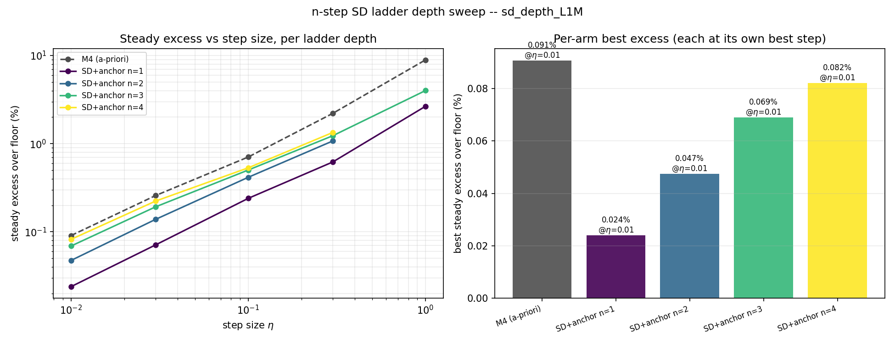

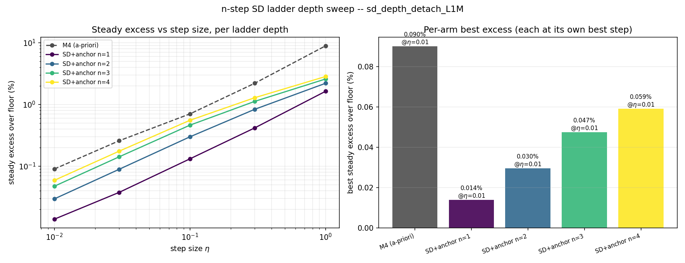

### 4.2 Convergence: keep is faster, detach reaches a lower floor

At the best step `eta=0.01`, n=1 excess vs context length (single sampled
steps of the curve; `--` = the median-among-stable read at/below the floor or
no trajectory was stable at that sample -- an artifact of the marginal
default-init population at small gains, which is why the tail-averaged floors
in 4.1 are the robust readout):

| context | keep=True | keep=False (detach) |
|---|---|---|
| 3,000 | 27.3% | 36.2% |
| 10,000 | 5.2% | 15.4% |
| 30,000 | -- | 4.37% |
| 100,000 | 0.030% | -- |
| 300,000 | 0.011% | 0.006% |
| 1,000,000 | 0.022% (tail floor **0.024%**) | 0.027% (tail floor **0.014%**) |

`keep_launch=True` is ~3x or more lower excess through the mid-context regime
-- the launch gradient is a strong convergence accelerator. It plateaus by
~100k; the detached variant is still descending and crosses below keep in the
200-300k range, then separates: the tail-averaged floors read **detach 0.014%
vs keep 0.024%**. So the two effects are cleanly separated: **keep converges
faster, detach bottoms out lower.**

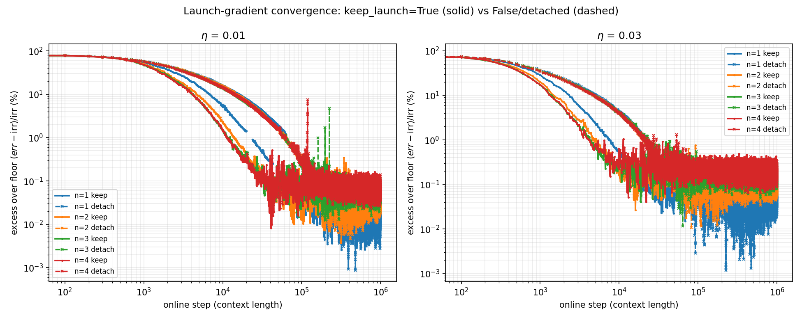

Solid = keep, dashed = detach, same color per depth. The earlier `L=100000`
sweep mis-ranked detach precisely because it stopped before this crossover: at
100k, detach@`eta=0.01` read 0.436% (under-converged) vs keep's 0.040%; the
converged run resolves it to 0.014% vs 0.024%.

**Depth is the same speed/floor tradeoff.** Excess vs context length at
`eta=0.03`, `keep_launch=True`, per depth:

| context | n=1 | n=2 | n=3 | n=4 |
|---|---|---|---|---|
| 3,000 | 6.22% | 2.92% | 2.08% | 2.19% |
| 10,000 | 0.52% | 0.16% | 0.24% | 0.22% |
| 30,000 | 0.079% | 0.102% | 0.379% | 0.108% |
| 100,000 | 0.079% | 0.106% | 0.175% | 0.229% |
| 300,000 | 0.173% | 0.147% | 0.192% | 0.249% |
| 1,000,000 | **0.080%** | 0.152% | 0.198% | 0.251% |

Early (ctx <= 10k) the deeper ladders lead by 2-3x; the curves cross around
ctx ~10-30k, and by the tail the ordering fully inverts to `n=1` lowest.

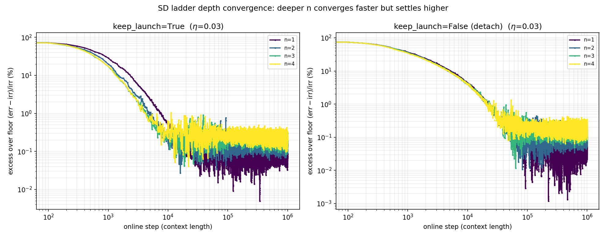

Left = `keep_launch=True`, right = detach; color = depth. The effect is
pronounced with the launch gradient on (clear early fan-out then inversion) and
muted when detached (depths track together early since detaching already
weakens the gradient signal), but the tail floor ordering (`n=1` lowest) holds
in both.

### 4.3 Stability grids

Full grid, `L=1000000`, each cell `tail %stable | ndiv (of 16)`:

**keep_launch=True:**

| depth | eta=0.01 | eta=0.03 | eta=0.1 | eta=0.3 | eta=1.0 |
|---|---|---|---|---|---|
| n=1 | 0.54 \| 0 | 0.99 \| 0 | 1.00 \| 0 | 0.46 \| 9 | 0.07 \| 15 |
| n=2 | 0.97 \| 0 | 1.00 \| 0 | 0.79 \| 5 | 0.12 \| 14 | 0.00 \| 16 |
| n=3 | 1.00 \| 0 | 1.00 \| 0 | 0.75 \| 4 | 0.69 \| 5 | 0.06 \| 15 |
| n=4 | 1.00 \| 0 | 1.00 \| 0 | 0.62 \| 6 | 0.62 \| 6 | 0.00 \| 16 |

**keep_launch=False (detach):**

| depth | eta=0.01 | eta=0.03 | eta=0.1 | eta=0.3 | eta=1.0 |
|---|---|---|---|---|---|
| n=1 | 0.24 \| 0 | 0.54 \| 0 | 1.00 \| 0 | 1.00 \| 0 | 1.00 \| 0 |
| n=2 | 0.74 \| 0 | 1.00 \| 0 | 1.00 \| 0 | 1.00 \| 0 | 1.00 \| 0 |
| n=3 | 0.99 \| 0 | 1.00 \| 0 | 1.00 \| 0 | 1.00 \| 0 | 1.00 \| 0 |
| n=4 | 1.00 \| 0 | 1.00 \| 0 | 1.00 \| 0 | 1.00 \| 0 | 0.88 \| 2 |

Three observations:

1. **Small gain (eta <= 0.03): deeper is *more* stable at the tail** (keep
   `eta=0.01`: 0.54 -> 0.97 -> 1.00 -> 1.00, zero divergences) -- faster
   convergence settles the filter into a stable configuration sooner. The
   small-`eta` %stable values improve with horizon (keep `n=1` @0.01 read 1%
   at 300k, 54% here) but stay marginal at `n=1` -- the optimal filter hugs
   the unit circle, `rad ~ 1.00`.
2. **Moderate-to-aggressive gain (eta >= 0.1): keep bleeds trajectories, and
   more of them the longer it runs.** At `eta=1.0` the keep column reads
   15 / 16 / 15 / 16 divergences (vs 11 / 9 / 15 / 15 at 300k; two cells now
   fully diverged, `excess = inf`), and the bleeding extends down to
   `eta=0.1-0.3` (4-14 divergences for `n >= 2`). The deeper `F^k` roll-out
   drives `F` harder toward self-consistency, and divergence is absorbing.
3. **Detach removes the depth-driven instability** -- zero divergences
   everywhere except the extreme `n=4`/`eta=1.0` corner (2/16), with counts
   unchanged from 300k.

### 4.4 Study-1 reading

1. **Depth is a speed/floor knob, losing only at the stationary limit** -- and
   its early-convergence benefit is exactly the property that could matter
   under non-stationarity.
2. **The launch gradient is a speed/floor/stability trilemma, and detach wins
   two of three.** Given enough context, the detached variant is the strictly
   better operating point at this init -- and the stability gap *widens* with
   horizon.
3. **Best configuration: detached, single-step, small-gain, long-run**
   (`keep_launch=False, n=1, eta=0.01`, 0.014%) -- though read off a
   ~24%-stable marginal population; the A-init (study 2) reaches the same
   floor at 100%.

---

## 5. Study 2: A-init, sum reduction (`sd_depth_ainit_L1M` / `sd_depth_ainit_detach_L1M`)

Source: [`nstep_sd_ladder_launch_ainit_findings.md`](nstep_sd_ladder_launch_ainit_findings.md)
(originally at `L=300000`; tables below are from the `L=1000000` re-runs).
The init study ([`init_pathway_findings.md`](init_pathway_findings.md)) found
that the A-init `f0_kpinv` (`F=0, K=H^+`, the toy `K=A` replace/high-gain end)
converges faster, is 100% stable at every step, and lands in a **contractive**
basin at the *same* floor as the default init. This study re-runs the full
depth x launch grid with every arm (including the M4 control) on the A-init
(`--f-init zero --k-init pinv`); the two init CLI flags default to reproducing
the study-1 sweep exactly.

### 5.1 Per-arm best and full excess grids

Per-arm best (each at its own best step, which is `eta=0.01` for every arm;
`%stbl` at the best step in parentheses):

| arm | keep=True best | detach best |
|---|---|---|
| M4 (a-priori control) | 0.089% (100%) | 0.089% (100%) |
| SD+anchor n=1 | 0.027% (100%) | **0.014% (100%)** |
| SD+anchor n=2 | 0.054% (100%) | 0.033% (100%) |
| SD+anchor n=3 | 0.077% (100%) | 0.054% (100%) |
| SD+anchor n=4 | 0.090% (100%) | 0.068% (100%) |

(At 300k the detached `n=1` best fell at `eta=0.03`, an artifact of the
under-converged `eta=0.01` cell -- 0.257% there, still descending. At 1M the
cell has converged to 0.014% and every arm's best step is `eta=0.01`, in both
variants; see section 7.)

Full steady-excess grids, tail `%stable` in parentheses; `ndiv=0` for every
cell except the detached `n=4, eta=1.0` (`ndiv=1`, 94% stable):

**keep_launch=True (`sd_depth_ainit_L1M`):**

| arm | eta=0.01 | eta=0.03 | eta=0.1 | eta=0.3 | eta=1.0 |
|---|---|---|---|---|---|
| M4 constant | 0.089 (100%) | 0.255 (100%) | 0.678 (100%) | 2.180 (100%) | 8.855 (100%) |
| SD+anchor n=1 | **0.027 (100%)** | 0.079 (100%) | 0.240 (100%) | 0.626 (100%) | 2.123 (100%) |
| SD+anchor n=2 | 0.054 (100%) | 0.150 (100%) | 0.397 (100%) | 1.012 (100%) | 3.349 (100%) |
| SD+anchor n=3 | 0.077 (100%) | 0.200 (100%) | 0.499 (100%) | 1.225 (100%) | 3.983 (100%) |
| SD+anchor n=4 | 0.090 (100%) | 0.232 (100%) | 0.559 (100%) | 1.333 (100%) | 4.316 (100%) |

**keep_launch=False / detached (`sd_depth_ainit_detach_L1M`):**

| arm | eta=0.01 | eta=0.03 | eta=0.1 | eta=0.3 | eta=1.0 |
|---|---|---|---|---|---|
| M4 constant | 0.089 (100%) | 0.255 (100%) | 0.678 (100%) | 2.180 (100%) | 8.855 (100%) |
| SD+anchor n=1 | **0.014 (100%)** | 0.041 (100%) | 0.140 (100%) | 0.420 (100%) | 1.441 (100%) |
| SD+anchor n=2 | 0.033 (100%) | 0.099 (100%) | 0.334 (100%) | 0.880 (100%) | 2.208 (100%) |
| SD+anchor n=3 | 0.054 (100%) | 0.163 (100%) | 0.519 (100%) | 1.178 (100%) | 2.593 (100%) |
| SD+anchor n=4 | 0.068 (100%) | 0.204 (100%) | 0.623 (100%) | 1.339 (100%) | 2.816 (94%) |

Median `|lambda(F_hat)|` reads **0.81-0.82 at `eta <= 0.3`** and drifts down to
0.77-0.80 at the bruising `eta=1.0` in both variants -- every cell sits
*inside* the true spectrum `|eig(F)| in [0.778, 0.900]` or contractive of it,
never on the unit circle. This is the A-init's contractive basin holding across
the entire depth x launch grid, unmoved by the 1M horizon. Contrast study 1,
where the `fI` init drifted to `|lambda| ~ 1.00` under SD self-consistency
pressure and stability at small gains stayed marginal even at 1M.

**Detach has lower excess than keep at every matched (arm, step) cell of the
grid** -- from 0.014% vs 0.027% at the accuracy end (`n=1, eta=0.01`) to
2.816% vs 4.316% at the bruising end (`n=4, eta=1.0`) -- the same ordering as
study 1, but now *both* variants are fully stable rather than detach being
stable and keep blowing up.

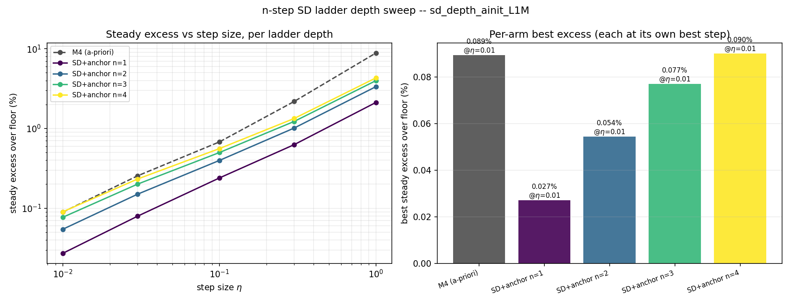

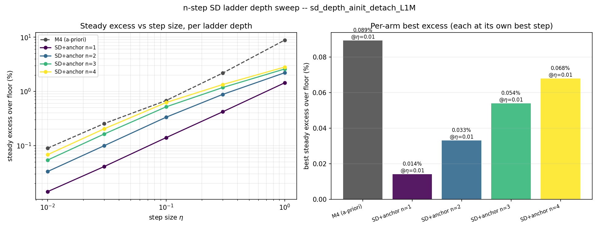

### 5.2 Convergence: keep is faster, detach crosses below past 300k

At `n=1`, excess vs context length (%):

| ctx | keep @0.01 | detach @0.01 | keep @0.03 | detach @0.03 |
|---|---|---|---|---|
| 3,000 | 20.2 | 22.0 | 6.31 | 6.65 |
| 10,000 | 5.81 | 6.14 | 2.10 | 3.51 |
| 30,000 | 2.02 | 3.43 | 0.426 | 1.88 |
| 100,000 | 0.280 | 1.69 | 0.101 | 0.227 |
| 300,000 | 0.019 | 0.167 | 0.055 | 0.027 |
| 1,000,000 | 0.022 | **0.013** | 0.067 | **0.039** |

- **keep @0.01 is converged by ~300k** (0.019% -> 0.022%, flat to noise) at
  its 0.027% tail-averaged floor.
- **detach @0.01 needs the full horizon**: still at 0.167% at 300k (the
  under-convergence that mis-ranked the 300k study), it drops another ~13x by
  1M and crosses below keep somewhere past 300k, converging to the 0.014%
  floor.
- **At `eta=0.03`, both are long converged and detach is lower** (0.041% vs
  0.079% tail-averaged) -- the same ordering, visible one gain up much
  earlier.

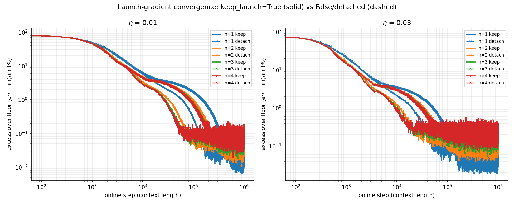

Solid = keep, dashed = detach, color = depth. Left `eta=0.01`, right
`eta=0.03`. Keep descends faster throughout; the depths fan out early (deeper
faster) and re-order to `n=1`-lowest at the tail; the dashed detach curves end
below the solid keep ones at both gains.

**Depth is the same speed/floor tradeoff.** Excess vs context (%) at
`eta=0.03`, `keep_launch=True`, per depth:

| ctx | n=1 | n=2 | n=3 | n=4 |
|---|---|---|---|---|
| 3,000 | 6.31 | 3.85 | 3.42 | 3.31 |
| 10,000 | 2.10 | 1.21 | 0.91 | 0.83 |
| 30,000 | 0.426 | 0.160 | 0.219 | 0.277 |
| 100,000 | 0.101 | 0.199 | 0.266 | 0.275 |
| 300,000 | 0.055 | 0.141 | 0.212 | 0.233 |
| 1,000,000 | **0.067** | 0.108 | 0.141 | 0.162 |

Early (ctx <= 10k) the deeper ladders lead by ~2x, the curves cross around
ctx ~30-100k, and by the tail the ordering fully inverts to `n=1` lowest --
identical in shape to study 1.

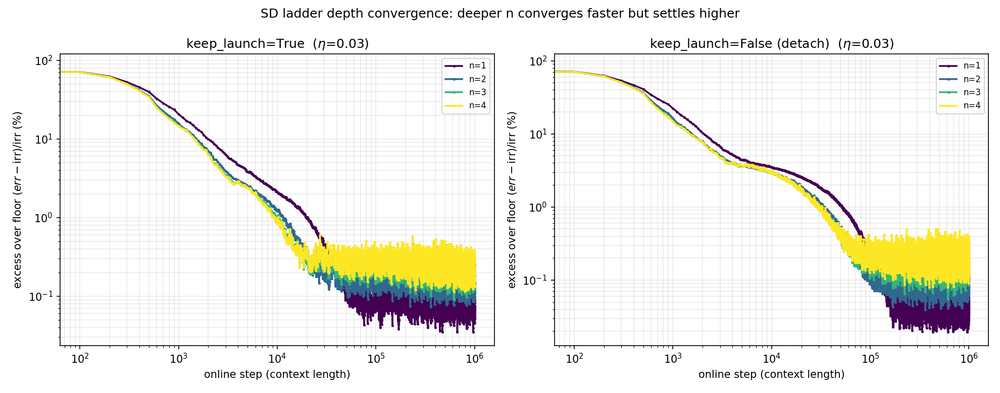

Left = keep, right = detach; color = depth.

### 5.3 Stability: the launch-gradient instability is gone

Diverged trajectories (out of 16) at `eta=1.0`, `L=1000000`, A-init vs default
init:

| arm | default keep | default detach | A-init keep | A-init detach |
|---|---|---|---|---|
| SD+anchor n=1 | 15 | 0 | **0** | **0** |
| SD+anchor n=2 | 16 | 0 | **0** | **0** |
| SD+anchor n=3 | 15 | 0 | **0** | **0** |
| SD+anchor n=4 | 16 | 2 | **0** | **1** |

At the default init, detaching the launch was the fix for the
recursive-gradient blow-up -- and the blow-up compounds with exposure (the
default-keep column grew from 9-15 at 300k to 15-16 here). The A-init makes
the fix redundant: growing `F`'s dynamics up from zero keeps the learned `F`
contractive, so the launch gradient has no near-unit-circle `F` to
destabilize, at any horizon.

### 5.4 Study-2 reading

1. **Depth verdict: unchanged** from study 1 at either init.
2. **Launch verdict: reduced to pure speed vs floor.** The stability leg of
   the trilemma moves to the init; keep converges ~3x faster (at its floor by
   ~200-300k) and is now safe, while detach converges to a strictly lower
   floor at every matched cell (0.014% vs 0.027% at the best one) given ~1M
   steps. So the launch choice on the A-init is purely a horizon call: **keep
   for short horizons, detach for the converged optimum** -- with no stability
   penalty either way.
3. **The A-init is a free accelerator here too**: it gives the launch gradient
   back for free -- `keep_launch=True`'s convergence speedup no longer carries
   a stability tax. And unlike study 1, both converged floors are read off
   fully-stable populations.
4. **The floor is unchanged by the init** (as the init study predicted): the
   A-init changes the trajectory and the basin, not the destination -- the
   detached `n=1` floor is 0.014% at both inits; only the population stability
   differs (100% vs 24%).

---

## 6. Study 3: A-init, mean reduction (`sd_depth_ainit_mean_L1M` / `sd_depth_ainit_mean_detach_L1M`)

Source: [`nstep_sd_ladder_launch_ainit_mean_findings.md`](nstep_sd_ladder_launch_ainit_mean_findings.md)
(originally at `L=300000`; tables below are from the `L=1000000` re-runs).
Identical to the study-2 sweep except for the new `--sd-mean` flag, which
divides each target's ladder contribution by `n_eff = min(sd_horizon, j+1)`
(the number of distinct horizons that reach a buffered launch; horizons past
the detached root collapse to one term and are already excluded). Run only on
the A-init, the basin the sum study settled on; the study-2 numbers are the
reference throughout. Because `n=1` is bit-identical under sum and mean
(verified in a parity test and smoke run), the study genuinely only re-prices
depth `n >= 2`.

### 6.1 Per-arm best, sum vs mean side by side

Floor = 0.0546; every best step is `eta=0.01`; every cell 100% stable:

| arm | mean keep | sum keep | mean detach | sum detach |
|---|---|---|---|---|
| M4 (a-priori control) | 0.089% | 0.089% | 0.090% | 0.089% |
| SD+anchor n=1 | 0.027% | 0.027% | **0.014%** | **0.014%** |
| SD+anchor n=2 | 0.031% | 0.054% | 0.020% | 0.033% |
| SD+anchor n=3 | 0.033% | 0.077% | 0.024% | 0.054% |
| SD+anchor n=4 | 0.034% | 0.090% | 0.026% | 0.068% |

`n=1` matches the sum study by construction (the tiny M4/`n=1` reference diffs
vs sum are run-to-run drift, not the reduction). The signal is the deeper
arms: the mean nearly ties them to `n=1` in both launch variants -- keep
0.031-0.034% vs the sum's 0.054-0.090%, detach 0.020-0.026% vs the sum's
0.033-0.068% -- but `n=1` stays (slightly) lowest everywhere, and the overall
winner is unchanged: detach `n=1` at 0.014%.

### 6.2 Full excess grids: depths compressed, 100% stable everywhere

`ndiv=0` for **every** cell in both variants (the sum's lone detached
`n=4, eta=1.0` casualty is gone).

**keep_launch=True (`sd_depth_ainit_mean_L1M`):**

| arm | eta=0.01 | eta=0.03 | eta=0.1 | eta=0.3 | eta=1.0 |
|---|---|---|---|---|---|
| M4 constant | 0.089 (100%) | 0.254 (100%) | 0.680 (100%) | 2.180 (100%) | 8.848 (100%) |
| SD+anchor n=1 | **0.027 (100%)** | 0.080 (100%) | 0.242 (100%) | 0.626 (100%) | 2.120 (100%) |
| SD+anchor n=2 | 0.031 (100%) | 0.090 (100%) | 0.263 (100%) | 0.662 (100%) | 2.162 (100%) |
| SD+anchor n=3 | 0.033 (100%) | 0.096 (100%) | 0.273 (100%) | 0.672 (100%) | 2.134 (100%) |
| SD+anchor n=4 | 0.034 (100%) | 0.099 (100%) | 0.285 (100%) | 0.688 (100%) | 2.139 (100%) |

**keep_launch=False / detached (`sd_depth_ainit_mean_detach_L1M`):**

| arm | eta=0.01 | eta=0.03 | eta=0.1 | eta=0.3 | eta=1.0 |
|---|---|---|---|---|---|
| M4 constant | 0.090 (100%) | 0.254 (100%) | 0.678 (100%) | 2.180 (100%) | 8.855 (100%) |
| SD+anchor n=1 | **0.014 (100%)** | 0.041 (100%) | 0.140 (100%) | 0.420 (100%) | 1.441 (100%) |
| SD+anchor n=2 | 0.020 (100%) | 0.060 (100%) | 0.201 (100%) | 0.586 (100%) | 1.866 (100%) |
| SD+anchor n=3 | 0.024 (100%) | 0.072 (100%) | 0.237 (100%) | 0.660 (100%) | 1.926 (100%) |
| SD+anchor n=4 | 0.026 (100%) | 0.077 (100%) | 0.251 (100%) | 0.687 (100%) | 1.963 (100%) |

Compare the sum keep grid, where `n=4` ran 0.090 / 0.232 / 0.559 / 1.333 /
4.316 across the same steps -- roughly `n`x the `n=1` row. The mean rows sit
within ~1.05-1.3x of `n=1` everywhere. Median `|lambda(F_hat)|` reads **0.82 at
`eta <= 0.1`** across all depths and drifts to 0.71-0.80 at `eta=1.0` -- the
same contractive basin as study 2, unchanged by the reduction or the horizon.

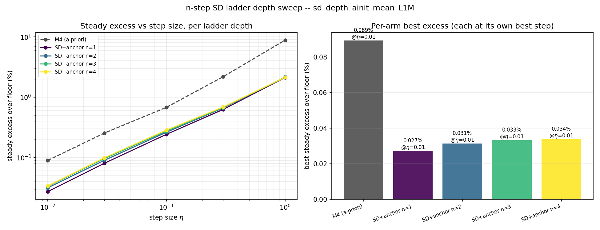

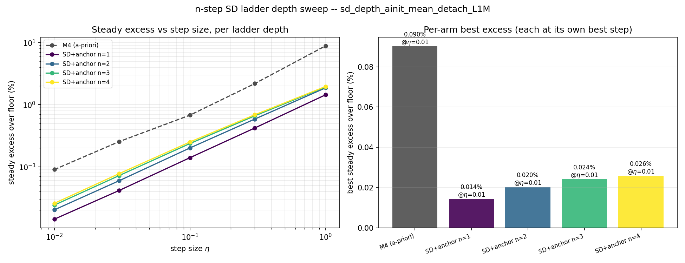

### 6.3 Convergence: depth loses its early-speed edge under the mean

`n=1` excess vs context (%) -- identical to study 2 by construction (keep
@0.01 at its floor by ~300k; detach @0.01 crossing below it past 300k):

| ctx | keep @0.01 | detach @0.01 | keep @0.03 | detach @0.03 |
|---|---|---|---|---|
| 3,000 | 20.2 | 22.3 | 6.66 | 6.85 |
| 10,000 | 5.81 | 6.03 | 2.09 | 3.47 |
| 30,000 | 2.02 | 3.44 | 0.465 | 1.90 |
| 100,000 | 0.280 | 1.67 | 0.073 | 0.223 |
| 300,000 | 0.019 | 0.178 | 0.101 | 0.054 |
| 1,000,000 | 0.022 | **0.013** | 0.093 | **0.038** |

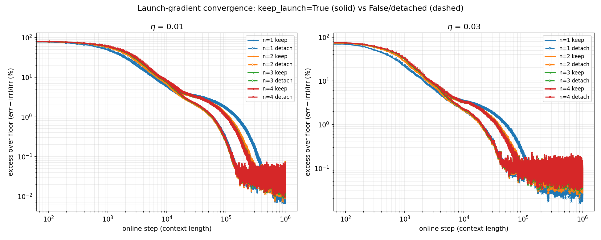

The depth story is where the mean diverges from the sum. Excess vs context (%)
at `eta=0.03`, `keep_launch=True`, per depth:

| ctx | n=1 | n=2 | n=3 | n=4 |
|---|---|---|---|---|
| 3,000 | 6.66 | 7.72 | 8.66 | 8.97 |
| 10,000 | 2.09 | 2.09 | 2.21 | 2.26 |
| 30,000 | 0.465 | 0.390 | 0.412 | 0.420 |
| 100,000 | 0.073 | 0.080 | 0.076 | 0.078 |
| 300,000 | 0.101 | 0.118 | 0.117 | 0.115 |
| 1,000,000 | **0.093** | 0.106 | 0.105 | 0.104 |

Under the **sum**, this same table had the deeper ladders *leading* by ~2x
early (n=4 3.31 vs n=1 6.31 at 3k) before inverting to `n=1`-lowest at the
tail -- a clean speed/floor fan-out. Under the **mean**, the early lead is
**gone**: deeper is marginally *slower* at 3k, the depths are essentially on
top of each other from 10k onward, and `n=1` is (barely) lowest at the tail.
The multi-horizon gradient's early acceleration was its summed magnitude;
average it away and the extra horizons add nothing on this stationary problem.

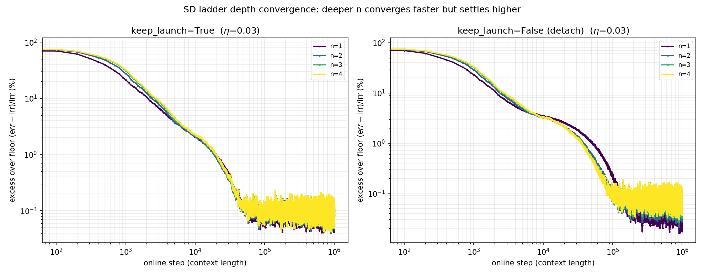

Left = keep, right = detach; color = depth. (Detach @`eta=0.03` shows the
deeper arms reaching the mid-context floor a bit sooner -- 30k: n=4 1.28 vs
n=1 1.90 -- because detaching weakens `n=1`'s gradient more than it weakens
the averaged deep ladder; but `n=1` still wins the tail, 0.041% vs
0.060-0.077% tail-averaged.)

### 6.4 Stability: the mean removes the last casualty

Diverged trajectories (out of 16) at `eta=1.0`, `L=1000000`:

| arm | A-init sum keep | A-init sum detach | A-init mean keep | A-init mean detach |
|---|---|---|---|---|
| SD+anchor n=1 | 0 | 0 | **0** | **0** |
| SD+anchor n=2 | 0 | 0 | **0** | **0** |
| SD+anchor n=3 | 0 | 0 | **0** | **0** |
| SD+anchor n=4 | 0 | 1 | **0** | **0** |

The A-init already made both launch variants essentially fully stable; the
mean removes the last corner casualty (the detached `n=4, eta=1.0` cell) by
shrinking the effective SD magnitude at depth. `rad` stays contractive
(0.71-0.82) everywhere.

### 6.5 Study-3 reading

1. **The sum's depth tradeoff was a magnitude artifact.** The mean holds the
   magnitude fixed and both halves collapse: floors compress to near-`n=1`, and
   the early speedup disappears.
2. **The multi-horizon information alone buys nothing here.** With magnitude
   controlled, adding autonomous horizons `k = 2..n` neither accelerates early
   descent nor lowers the floor -- deeper is uniformly a hair worse.
3. **`n=1` remains the recommendation, now for a simpler reason** -- it wins
   essentially everywhere with no tradeoff surrendered. The launch verdict is
   inherited unchanged from study 2 (it lives entirely at `n=1`): keep for
   short horizons, detach (0.014%) for the converged optimum.

---

## 7. Horizon effects: what the 300k studies got wrong (and right)

The three source studies ran at `L=300000`; all six sweeps were re-run in full
at `L=1000000` (the basis of every table above), "for completion":

```bash
OUT_PREFIX=sd_depth_L1M \
  bash scripts/submit_sd_depth_sweep.sh -L 1000000 --keep-launch
OUT_PREFIX=sd_depth_detach_L1M \
  bash scripts/submit_sd_depth_sweep.sh -L 1000000 --no-keep-launch
OUT_PREFIX=sd_depth_ainit_L1M \
  bash scripts/submit_sd_depth_ainit_sweep.sh -L 1000000
OUT_PREFIX=sd_depth_ainit_mean_L1M \
  bash scripts/submit_sd_depth_ainit_sweep.sh -L 1000000 --sd-mean
```

This section records what changed between the horizons -- the horizon is
itself a finding, because every "which variant wins" answer in this line has
been a function of it.

1. **The A-init launch verdict flipped.** At 300k the detached `eta=0.01`
   column read 0.170-0.257% (still descending), so its own-best step landed at
   `eta=0.03` and keep @0.01 (0.024-0.027%) was the best converged cell --
   the source studies recommended `keep_launch=True` on the A-init. At 1M the
   detached column converges to **0.014%** at `n=1` in every sweep (exactly
   the init study's independent 1M readout of 0.013-0.015%), crossing below
   keep somewhere past 300k. This is the same crossover the `L=100000` sweep
   missed at the default init, one octave up: **every horizon in this line
   mis-ranked the launch knob until the next-longer run resolved it.** The
   1M-era verdicts (sections 3-6) stand on converged cells at both gains.
2. **Default-init keep divergences accumulate with exposure.** At `eta=1.0`
   the keep column went from 9-15 of 16 diverged at 300k to 15-16 at 1M (two
   cells fully diverged), and the bleeding extended down into `eta=0.1-0.3`
   (e.g. `n=1` @0.3: 2 -> 9). Divergence under the launch gradient at the
   default init is an absorbing state: every extra step is another chance to
   tip over the unit circle, and no trajectory comes back. Detach (0 -> 0
   everywhere, `n=4, eta=1.0` at 2 -> 2) and the entire A-init grid hold
   their counts.
3. **The default-init marginal basin improves with horizon but does not
   heal.** Small-step tail stability rose (keep `n=1` @0.01: 1% at 300k ->
   54% at 1M; detach: 12% -> 24%; M4: 35% -> 100%) but the SD arms plateau
   far short of 100% -- the same pattern the init study saw for every `fI`
   arm. The A-init reads 100% everywhere at `eta <= 0.3`, at both horizons.
4. **Everything else was horizon-stable.** The depth ordering (`n=1` lowest,
   sum floors ~`n`x, mean floors compressed), the contractive A-init spectrum
   (`rad` 0.81-0.82), and the M4 control all read the same at 300k and 1M --
   the escalation changed the launch verdict and the stability tallies,
   nothing else.

### 7.1 Recommendation

- **Deploy target (stationary, long horizon): A-init, detach, `n=1`,
  `eta=0.01`** -- 0.014% excess, 100% stable, converged.
- **Short/medium horizon (fewer than ~300k adaptation steps): A-init, keep,
  `n=1`** -- reaches its 0.024-0.027% floor ~3x sooner and is equally stable
  on the A-init; this was the 300k-era recommendation and it remains correct
  *for that horizon*.
- **Never: keep at the default init at moderate-or-larger gains** -- its
  divergences grow with exposure.

---

## 8. Open caveats and follow-ups

- ~~Detached `eta=0.01` under-converged at `L=300000`~~ -- **resolved by the
  1M re-runs (section 7)**: the column converges to 0.014% at `n=1` in every
  sweep, and detach wins the converged floor outright.

- **Gain migration per depth** (the `||K||`, `||KH - H^+H||` A->K diagnostic
  from the init study,
  [`scripts/plot_init_gain_migration.py`](../scripts/plot_init_gain_migration.py))
  was not run on the depth grids; it would show whether deeper ladders / the
  launch gradient change how far the gain walks from the replace limit.
  Optional, if the migration picture across the ladder is wanted.

- **Non-stationary / video implication.** The stationary picture is settled:
  `n=1`, A-init, detached launch at long horizons (keep for short ones). But
  the decisive axis throughout was *convergence horizon*, which is exactly
  what non-stationarity removes -- a tracking filter never gets 300k
  stationary steps, which puts it squarely in the regime where keep (and the
  A-init's transient acceleration) win. Study 1 flagged the early-speed
  advantages of `keep_launch=True` and deeper `n` as the properties that could
  reverse the verdict under drift. Study 3 sharpens that: depth's early speed
  is purely a gradient-magnitude effect, so under non-stationarity a deeper
  *summed* ladder and a larger `alpha`/gain at `n=1` are likely
  interchangeable accelerators, and the mean reduction removes depth as an
  independent knob. A drift study wanting the ladder's early speed should use
  the sum (or tune the gain), not the mean -- and should sweep the launch
  variant, since `keep_launch=False` remains the cheap stability fix when an
  aggressive constant gain is required at the default init (where, per 7.3,
  keep's divergences compound with exposure).
