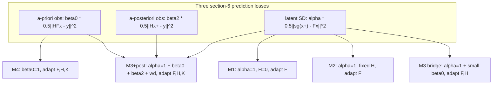

# Test-time-training / self-distillation study manifest

This document pins down the exact hyperparameters and components of the test-time
adaptive-estimation study for the linear LQE toy case, so the moving parts stop
being murky. It records:

1. The 3 "best performing" final experiments (the videos in `output/sd_video/`).
2. The 3 loss components, exactly as implemented in
   [`src/kf_rnn/model/sequential/rnn_ttt.py`](src/kf_rnn/model/sequential/rnn_ttt.py).
3. The method catalogue (M1-M4 + M3+post) and how it maps onto the loss weights.
4. An inventory of every residual `output/` directory and its generating config.
5. A recommendation for a minimal-hyperparameter redo.
6. The results of that redo executed at long context (`sd_m3m4_L10000`, L=10000)
   plus the optimal/online FIR benchmarks.

The single clean experiment runner is intentionally **deferred** to a follow-up;
this manifest is the input to that decision.

---

## 0. The three loss components (the only thing we are actually studying)

Everything reduces to three per-step prediction losses on the linear filter
`(F, H, K)` with state `x` and observation `y`, defined in
`RnnSelfDistillPredictor._window_loss`:

| term | weight | formula | role |
|---|---|---|---|
| a-priori observation | `beta0` | `0.5 * ||H F x_{t-1} - y_t||^2` | grounding (the M4 / today objective) |
| a-posteriori observation | `beta2` | `0.5 * ||H x_t^+ - y_t||^2` | direct-K residual (DESIGN.md section 6.1) |
| latent self-distillation | `alpha` | `0.5 * ||sg(x_t^+) - F x_{t-1}^+||^2` | bootstrap the latent dynamics (section 4.2/6) |



Everything else (`adapt_keys`, `weight_decay`, frozen-`K` init, the `H=0` trick)
is plumbing that exists only to express the canvas methods M1-M4 through these
three weights. Section 2 documents that plumbing; section 5 recommends removing
most of it.

---

## 1. The three final experiments

All three are produced by
[`scripts/ttt_impulse_video.py`](scripts/ttt_impulse_video.py). The exact loss
weights were never written to disk; they were **recovered from the embedded
suptitle of each mp4** (the only surviving record). The recovered titles read:

```
m3post_eps0.1:  alpha=1.0, beta0=0.05, beta2=0.05, adapt=F,H,K, wd=0.001; eps=0.1, window=4, step_size=0.03, N=16   (step .../600)
m4_eps0.1:      alpha=0.0, beta0=1.0,  beta2=0.0,  adapt=F,H,K, wd=0.0;   eps=0.1, window=4, step_size=0.03, N=16   (step .../600)
m3post_eps0.3:  alpha=1.0, beta0=0.05, beta2=0.05, adapt=F,H,K, wd=0.001; eps=0.3, window=4, step_size=0.09, N=16   (step .../600)
```

### 1a. Shared hyperparameters (all 3)

| group | parameter | value | source |
|---|---|---|---|
| system | `S_D` (state dim) | 6 | default |
| system | `O_D` (obs dim) | **2** | `--o-d 2` (overrides default; videos use the 2x2 IR grid) |
| system | distribution | `ContinuousDistribution`, `f_mode=h_mode=gaussian` | default |
| system | `w_std`, `v_std` (noise std, scaled by eps) | 1.0, 1.0 | default |
| data | `N` (trajectories) | 16 | default |
| data | `L` (trace length = #frames) | **600** | `-L 600` (overrides the 1000 default; suptitle "step .../600") |
| data | `R` (IR lags) | 32 | default |
| TTT | `window` | **4** | `--window 4` (overrides the 8 default) |
| TTT | `n_steps` (SGD steps/timestep) | 1 | default |
| TTT | `lr_scale` -> `step_size` | `0.3 * eps` | default (`0.03` at eps=0.1; `0.09` at eps=0.3) |
| run | `seed` | 0 | default |
| run | mode | eval (`state0 = 0`, not `--train`) | default |
| init | frozen `K` | re-init to `randn(S_D,O_D)/sqrt(O_D)` only if `K` not adapted | code (here `K` is always adapted, so it starts at the `RnnPredictor` default `K=0`) |

### 1b. Per-experiment loss configuration

| experiment | method | eps | step_size | `alpha` | `beta0` | `beta2` | `adapt_keys` | `weight_decay` | analytical floor | result at L=600 |
|---|---|---|---|---|---|---|---|---|---|---|
| `m4_eps0.1.mp4` | M4 (a-priori obs) | 0.1 | 0.03 | 0.0 | 1.0 | 0.0 | F,H,K | 0.0 | 0.0688 | **4.3% over irreducible** (stable) |
| `m3post_eps0.1.mp4` | M3+post | 0.1 | 0.03 | 1.0 | 0.05 | 0.05 | F,H,K | 0.001 | 0.0688 | 11.7% over irreducible (stable) |
| `m3post_eps0.3.mp4` | M3+post | 0.3 | 0.09 | 1.0 | 0.05 | 0.05 | F,H,K | 0.001 | 0.586 | 6.3% over irreducible (stable) |

Reproduction commands (with the recovered overrides made explicit):

```bash
# M4, eps=0.1  (all loss weights are script defaults; only window/L/o-d overridden)
python scripts/ttt_impulse_video.py --o-d 2 --window 4 -L 600 --eps 0.1 \
    --out output/sd_video/m4_eps0.1.mp4

# M3+post, eps=0.1
python scripts/ttt_impulse_video.py --o-d 2 --window 4 -L 600 --eps 0.1 \
    --alpha 1.0 --beta0 0.05 --beta2 0.05 --weight-decay 0.001 \
    --out output/sd_video/m3post_eps0.1.mp4

# M3+post, eps=0.3  (the harder regime)
python scripts/ttt_impulse_video.py --o-d 2 --window 4 -L 600 --eps 0.3 \
    --alpha 1.0 --beta0 0.05 --beta2 0.05 --weight-decay 0.001 \
    --out output/sd_video/m3post_eps0.3.mp4
```

### 1c. Important caveat: the videos and the headline ladder disagree

The prose summary that motivated these as the "best" results ("M3+post 8.9% vs M4
10.9% at eps=0.1; M4 diverges at eps=0.3") came from the
`output/sd_losses/sd6_od6` analytical ladder (`--s-d 6 --o-d 6 -L 1000`), a
**different configuration** from the videos. The videos themselves
(`--o-d 2 -L 600`) show the opposite ranking at eps=0.1:

- **M4 = 4.3% over irreducible, M3+post = 11.7%** -> M4 is the better filter here.

There is no `m4_eps0.3` video, so the videos do not, on their own, demonstrate the
"M4 diverges where M3+post survives" claim; that claim rests on the `sd6_od6`
ladder. This `o_d=2` (videos) vs `o_d=6` (ladder) split, plus `L=600` vs `L=1000`,
is the single biggest source of the murkiness and is the first thing the redo
should eliminate (section 5).

---

## 2. The loss implementation in detail (`rnn_ttt.py`)

Source of truth:
[`RnnSelfDistillPredictor`](src/kf_rnn/model/sequential/rnn_ttt.py) (a thin
override of `RnnInContextPredictor`, which is the base gradient-TTT loop). The
window-averaged objective:

```233:265:src/kf_rnn/model/sequential/rnn_ttt.py
    def _window_loss(self,
                     theta: dict[str, torch.Tensor],
                     s_start: torch.Tensor,                  # [S_D]
                     win_actions: dict[str, torch.Tensor],   # [w x I_D]
                     win_obs: torch.Tensor,                  # [w x O_D]
    ) -> torch.Tensor:                                       # scalar
        """Window-averaged weighted three-term objective (see class docstring)."""
        s = s_start
        total = win_obs.new_zeros(())
        w = win_obs.shape[0]
        H_t, K_t = theta["H"], theta["K"]
        for j in range(w):
            action_j = {k: v[j] for k, v in win_actions.items()}
            obs_j = win_obs[j]
            out = torch.func.functional_call(self.cell, theta, (s, action_j, obs_j))
            y_hat = out["environment", "observation"]               # H F x_{t-1}^+
            s_post = out["environment", "state"]                    # x_t^+
            # Recover the a-priori state F x_{t-1}^+ from the Kalman update
            #   x_t^+ = F x_{t-1}^+ + K (y - y_hat)
            # so it is exact and keeps the autodiff dependence on theta["K"].
            innovation = obs_j - y_hat
            s_prior = s_post - innovation @ K_t.mT
            term = total
            if self.beta0 != 0.0:
                term = term + self.beta0 * 0.5 * (y_hat - obs_j).pow(2).sum(-1)
            if self.beta2 != 0.0:
                y_post = s_post @ H_t.mT
                term = term + self.beta2 * 0.5 * (y_post - obs_j).pow(2).sum(-1)
            if self.alpha != 0.0:
                term = term + self.alpha * 0.5 * (s_post.detach() - s_prior).pow(2).sum(-1)
            total = total + term
            s = s_post
        return total / w
```

Key mechanics:

- **Stop-gradient target.** The latent SD term uses `s_post.detach()` as the
  target and lets the gradient flow only through `s_prior = F x_{t-1}^+`, so `F`
  is nudged to absorb the correction (a TD(0) bootstrap). This mirrors the
  stop-grad form in
  [`scripts/self_distillation_eigenphase.py`](scripts/self_distillation_eigenphase.py).
- **`s_prior` recovery.** Rather than running a second recurrence, the a-priori
  state is recovered algebraically from the Kalman update
  `s_prior = s_post - innovation @ K^T`. This is exact and preserves the autodiff
  dependence on `K`.
- **`adapt_keys`.** `_optimizer_step` only updates the fast-weights named in
  `adapt_keys` (others are frozen); this is how M1/M2 freeze `H`/`K` while M4
  adapts all three.
- **`weight_decay`.** A decoupled per-update radial shrink
  `lambda -> (1 - step_size*weight_decay) lambda` applied to the updated weights;
  it is the linear analog of the `rate(eps)` penalty DESIGN.md section 6.1 pairs
  with the a-posteriori term.

```267:282:src/kf_rnn/model/sequential/rnn_ttt.py
    def _optimizer_step(self,
                        theta: dict[str, torch.Tensor],
                        grads: dict[str, torch.Tensor],
    ) -> dict[str, torch.Tensor]:
        """SGD on the ``adapt_keys`` only (others frozen), with optional decoupled
        weight decay applied to the updated weights."""
        updated: dict[str, torch.Tensor] = {}
        for k, v in theta.items():
            if k in self.adapt_keys:
                step = v - self.step_size * grads[k]
                if self.weight_decay != 0.0:
                    step = step - self.step_size * self.weight_decay * v
                updated[k] = step
            else:
                updated[k] = v
        return updated
```

### 2a. KNOWN BUG: the window loss double-counts earlier steps

In `_window_loss`, `term` is initialized to the running `total` and then `total`
is incremented by `term`:

```
term  = total                 # <-- carries the whole accumulated total
term  = term + (this step's weighted losses)
total = total + term          # <-- total = 2*total + this step's losses
```

So for a window of length `w`, step `j`'s losses are weighted by `2^(w-1-j)`
instead of `1`: the oldest step is counted `2^(w-1)` times, the newest once.
Consequence: even at the default `beta0=1, alpha=beta2=0`, this does **not**
reproduce the parent `RnnInContextPredictor`'s flat window-average (which is the
intended M4 baseline). For `window=4` (all three final experiments) the implicit
per-step weights are `[8, 4, 2, 1] / 4`. The effect is deterministic and
consistent across methods (so relative comparisons are not meaningless), but the
absolute objective is not the documented one.

**FIXED (2026-06-26).** `_window_loss` now initializes `term = win_obs.new_zeros(())`
instead of `term = total`, so each step is counted exactly once and the window
average is flat. With this fix `beta0=1, alpha=beta2=0` is exactly the parent
`RnnInContextPredictor` M4 baseline. Note that the three `sd_video/` results were
produced **before** this fix (with the `[8,4,2,1]/4` implicit weighting); the
`sd_m3m4_long` redo runs on the corrected objective and is therefore not directly
comparable to those videos.

Plumbing that lives outside the model, in the driver scripts:

- **Frozen-`K` random init.** `RnnPredictor` defaults `K=0`, which makes a
  frozen-`K` filter inert (zero impulse response). Both
  [`run_method`](scripts/self_distillation_losses.py) and the video script
  re-initialize a frozen `K` to `randn(S_D,O_D)/sqrt(O_D)`. When `K` is adapted
  (M4 / M3+post) the `K=0` start is fine.
- **M1 `H.zero_()`.** Setting the (frozen) decoder to 0 makes the innovation
  `y - H F x == y`, i.e. the raw `K y` injection of canvas M1.

**Recording & re-render (added 2026-06-26).** The (slow) per-method TTT sweep is
now persisted to `output/<out>/sd<S_D>_od<O_D>_save.pt` (every `MethodResult` plus
the system baselines `floor`/`ceiling`/`true_eig`/`truth_ir`/`steps_axis`, all on
CPU). `--reload` skips the sweep, loads those results, recomputes only the cheap
FIR benchmarks, and re-renders every plot -- so visualization tweaks (FIR lengths,
overlays) no longer require re-running the L=10000 sweep.

**FIR benchmarks (added 2026-06-26).** Two classical finite-length baselines are
overlaid on the analytical-error / excess plots and summarized in a dedicated
`*_fir_vs_length.png`:
- **Optimal analytical FIR** of length `R` -- the exact closed-form minimiser,
  computed by reusing `CnnAnalyticalLeastSquaresPredictor.newton_initialization`
  (one Newton step; the objective is quadratic in the taps). *Not* reimplemented.
  Its excess over the floor decays to ~0 by `R~=4` on the featured `sd6_od2`
  system (a short FIR already reaches the irreducible Kalman optimum).
- **Online least-squares FIR** (`CnnLeastSquaresPredictor.train_least_squares_online`)
  fit incrementally on the same trajectories; its exact analytical error is read
  out vs online step, directly comparable to the TTT curves.
Knobs: `--fir-lengths` (optimal sweep), `--online-fir-lengths`, `--fir-ridge`,
`--no-fir`. These change only the downstream visualization, not the TTT results.

---

## 3. Method catalogue (M1-M4 + M3+post)

From `default_methods` in
[`scripts/self_distillation_losses.py`](scripts/self_distillation_losses.py):

| method | `alpha` | `beta0` | `beta2` | `adapt_keys` | `h_init` | `weight_decay` | description |
|---|---|---|---|---|---|---|---|
| M1 raw-injection | 1.0 | 0.0 | 0.0 | (F,) | zero | 0 | latent SD only, decoder `H=0` -> raw `K y` injection |
| M2 error-correct | 1.0 | 0.0 | 0.0 | (F,) | random | 0 | latent SD only, fixed random decoder `H` |
| M3 bridge | 1.0 | `anchor` (0.05) | 0.0 | (F, H) | random | 0 | dominant latent SD + minimal a-priori anchor |
| M4 full obs | 0.0 | 1.0 | 0.0 | (F, H, K) | random | 0 | pure a-priori observation prediction (today's objective) |
| M3+post | 1.0 | `anchor` (0.05) | `post` (0.05) | (F, H, K) | random | `wd` (1e-3) | latent SD + anchor + a-posteriori + rate analog |

Defaults of the driver knobs: `anchor=0.05`, `post=0.05`, `weight_decay=1e-3`
(these are exactly the values recovered from the m3post videos, confirming the
videos used the driver defaults for the loss weights).

The same five methods are reachable from the video script via
`--alpha/--beta0/--beta2/--adapt-keys/--h-init/--weight-decay`.

There is also a **second, independent testbed**,
[`scripts/self_distillation_eigenphase.py`](scripts/self_distillation_eigenphase.py),
which implements M1/M2/M3 by a hand-written RLS/NLMS update (not gradient TTT)
purely to read out the eigen-phase / `|lambda|` story. It shares no code path with
the model loss above; it only samples an `LTISystem` and streams observations. Its
M3 "bridge" is `--compare-bridge` / `--h-anchor-lr` (a lightly-trained `H` anchor).

---

## 4. Residual `output/` inventory

Every directory below is a member of the TTT / self-distillation study **except
`in_context_large`**. "Recoverable?" indicates whether the full config can be
reconstructed from what is on disk (dims are encoded in filenames; loss weights
generally are not).

| dir | generator | mode / config (inferred) | recoverable? | status |
|---|---|---|---|---|
| `in_context_large` | (other project) | `CDCReconstruction_{cnn,rnn,transformer}` in-context experiment | n/a | **NOT a study member** (keep / out of scope) |
| `sd_video` | `ttt_impulse_video.py` | the 3 final experiments (section 1) | yes (this doc) | **keep (headline)** |
| `sd_losses` | `self_distillation_losses.py` | M1-M4 ladder; `sd6_od6` is the featured `--s-d 6 --o-d 6 -L 1000` analytical-curve run; `sd4_od2`/`sd6_od2` are earlier `-L 200` ladders | partial (weights = driver defaults) | keep `sd6_od6`; `sd4_od2`/`sd6_od2` superseded |
| `sd_losses_anchor0p5` | `self_distillation_losses.py` | anchor (`beta0`) ablation, `--anchor 0.5`, `sd6_od2` | partial | superseded by section-5 sweep |
| `sd_losses_anchor2` | `self_distillation_losses.py` | anchor ablation, `--anchor 2.0`, `sd6_od2` | partial | superseded |
| `sd_losses_eps03` | `self_distillation_losses.py` | `sd6_od6` ladder at `--eps 0.3 -L 1000` (harder regime) | partial | keep (paired with `sd_losses/sd6_od6`) |
| `sd_losses_fullobs_eps0p3` | `self_distillation_losses.py` | fully-observed `sd6_od6` at eps=0.3 | partial | superseded |
| `sd_m3m4_L10000` | `self_distillation_losses.py` | **the m3-vs-m4 redo (section 6).** 6-method `m3m4` preset, `--s-d 6 --o-d 2 --window 4 --eps 0.1 --step-size 0.03 -N 16 -L 10000 --weight-decay 0`, FIR benchmarks `--fir-lengths 1..8 --online-fir-lengths 2,4,8,16` | **yes** (`sd6_od2_save.pt` checkpoint + `vars(args)`) | **keep (headline m3m4)** |
| `sd_m3m4_long` | `self_distillation_losses.py` | earlier `m3m4` runs at shorter `L` (pre-recording / pre-FIR code); the recent `--reload` resubmit here failed (no checkpoint existed yet) | partial | superseded by `sd_m3m4_L10000` |
| `self_distillation_eigenphase` | `self_distillation_eigenphase.py` | default out dir: assorted `single` / `--compare-feedback` / `--compare-bridge` / `--compare-observation` / `seedsweep` runs (`sd2..sd4`) | partial (dims only) | exploratory; deletion candidate |
| `m2_check` | `self_distillation_eigenphase.py` | `--compare-feedback` (M1 vs M2), `sd6_od6` and `sd12_od12` | partial | exploratory; deletion candidate |
| `m3_bridge_check` | `self_distillation_eigenphase.py` | `--compare-bridge` (M1/M2/M3 RLS bridge) + feedback/single, `sd2..sd6` | partial | the weak RLS bridge demo that prompted the analytical readout; deletion candidate |
| `rls_check` | `self_distillation_eigenphase.py` | `--compare-observation` (full vs partial) + single, `sd4..sd20` | partial | exploratory; deletion candidate |
| `sd_wd_test` | `self_distillation_eigenphase.py` | weight-decay `single` runs, `sd4/sd6/sd12` | partial | exploratory; deletion candidate |

Note: top-level `output/ttt_impulse_response.{mp4,gif,png}` predate the
generalized video script (base M4 TTT only); they are the original reference the
videos were modeled on.

---

## 5. Recommendation: minimal-hyperparameter redo

Goal: study only the 3 losses, with one weight each and **everything else fixed**,
so the components we care about are not obscured. Concretely:

### 5.1 Loss surface = 3 weights, nothing else

- Keep exactly `alpha` (latent SD), `beta0` (a-priori obs), `beta2` (a-posteriori
  obs). All other loss-shaping knobs default to 0 / off:
  - `weight_decay = 0` by default (it is currently silently coupled to M3+post;
    make it an explicit, separately-justified add-on, not part of the base).
  - Derive `adapt_keys` from which weights are nonzero (e.g. adapt `F` whenever
    `alpha>0`, `H` whenever any obs term is on, `K` whenever `beta2>0` or in M4)
    instead of exposing it as a free knob. This removes the most error-prone
    degree of freedom.
- Define each canvas method as a one-line preset over `(alpha, beta0, beta2)`;
  ablate **one term at a time** from a single fixed base config.

### 5.2 Fix the window-loss bug first

Correct `_window_loss` so the window average is flat (`total = total + per_step`,
not `total = total + term`). This is a prerequisite: until it is fixed, `beta0=1`
is not the M4 baseline, and every "X% over irreducible" number is computed against
a subtly mis-weighted objective.

### 5.3 Eliminate the configuration split

Pick ONE system size and horizon for the headline comparison and use it
everywhere (both the analytical-error ladder and the videos):

- Resolve `o_d=2` (videos) vs `o_d=6` (ladder). Recommendation: run both the
  ladder and the videos at the **same** `o_d`, since the eps=0.1 ranking flips
  between them (section 1c). A partially-observed `o_d=2` is the more interesting
  LQE regime; if it is chosen, regenerate the `sd6_od6` ladder at `o_d=2` so the
  videos and the ladder tell one story.
- Pick one `L` (the videos used 600, the ladder 1000); use it for both.

### 5.4 Standardize the readout

- Single primary metric: **analytical excess over the irreducible floor**
  `(err - floor)/floor`, evaluated at the fixed `S_D/O_D/L`. It is exact (an
  expectation over the noise) and already implemented
  (`filter_analytical_error`). Drop the empirical one-step-MSE ratio entirely (it
  compresses toward 1 and is in-sample).
- Two fixed regimes only: `eps=0.1` (easy) and `eps=0.3` (hard). Always produce
  the M4 baseline in **both** regimes (the missing `m4_eps0.3` is why the "M4
  diverges" claim is currently unsupported by the videos).

### 5.5 Keep / delete (pending confirmation)

- **Keep:** `sd_video/` (re-render after 5.2-5.3), `sd_losses/sd6_od6` +
  `sd_losses_eps03` (the analytical ladders), `in_context_large` (out of scope).
- **Delete after the redo reproduces them:** `sd_losses_anchor0p5`,
  `sd_losses_anchor2`, `sd_losses_fullobs_eps0p3`, `sd_losses/sd4_od2`,
  `sd_losses/sd6_od2`, and the entire RLS eigenphase exploration
  (`self_distillation_eigenphase/`, `m2_check/`, `m3_bridge_check/`, `rls_check/`,
  `sd_wd_test/`) -- these are either superseded ablations or the second (RLS)
  testbed whose weak results motivated moving to the analytical readout.

### 5.6 Deferred

The single clean config-driven runner (one entry point that produces both the
analytical ladder and the per-step IR video from one method preset) is the
follow-up step, to be specified once the keep/delete decision above is confirmed.

---

## 6. m3-vs-m4 long-context results (`sd_m3m4_L10000`, 2026-06-27)

The section-5 redo, executed on the **corrected** `_window_loss` (section 2a) with
the three-weight `m3m4` preset, **no weight decay**, every method adapting
`(F, H, K)` from the *same* re-seeded initialization, on the partially-observed
`sd6_od2` system (eps=0.1, step_size=0.03, N=16, **L=10000**). Reproduce / re-render:

```bash
GPU_TYPE=l40s TIME=04:00:00 bash scripts/submit_sd_losses.sh \
  --methods m3m4 --s-d 6 --o-d 2 --window 4 --eps 0.1 --step-size 0.03 \
  -N 16 -L 10000 --weight-decay 0 --device cuda --out-name sd_m3m4_L10000 \
  --fir-lengths 1,2,3,4,5,6,7,8 --online-fir-lengths 2,4,8,16
# re-render plots from the checkpoint without re-running the sweep: add --reload
```

Steady-state readout (median over the 16 trajectories; `floor = 0.0546`,
`ceiling = 0.0990`). All six methods are **stable: `0/16` diverged**, so the
no-weight-decay stability question is resolved -- the earlier M3 instability worry
does not survive the bug fix + adapting `(F,H,K)`.

| method | `(alpha, beta0, beta2)` | excess over floor | rel. IR error |
|---|---|---|---|
| **M4** (a-priori) | `(0, 1, 0)` | **0.2%** | 0.025 |
| **SD+M4** | `(1, 1, 0)` | **0.3%** | 0.029 |
| M3+post no-wd | `(1, 0.05, 0.05)` | 0.6% | 0.156 |
| M3 bridge | `(1, 0.05, 0)` | 0.7% | 0.100 |
| SD+M4+post | `(1, 1, 1)` | 2.9% | 0.326 |
| M4+post | `(0, 1, 1)` | 3.2% | 0.339 |

### 6.1 Component isolation (the headline)

- **The a-posteriori term (`beta2`) hurts.** Every `beta2=1` method plateaus ~3%
  above the floor with high relative-IR error (~0.33); its `beta2=0` counterpart
  reaches <=0.3%. As currently weighted, the a-posteriori observation loss biases
  the filter *away* from the irreducible optimum rather than toward it. This is the
  most actionable negative result of the redo.
- **Latent SD (`alpha`) is ~neutral when grounded.** SD+M4 ~= M4 (0.3% vs 0.2%):
  adding latent self-distillation on top of strong a-priori grounding neither helps
  nor hurts the endpoint. Latent SD is *sufficient* for a stable, near-optimal
  filter only when paired with at least a minimal grounding anchor.
- **A minimal anchor (`beta0=0.05`) suffices for stability but is slow.** M3 bridge
  is stable and within 0.7%, but converges slowest (its curve is still descending
  at step 10000). The anchor weight trades convergence speed for the same endpoint
  -- it does not change *whether* the filter is stable, only *how fast* it locks on.

### 6.2 FIR benchmarks (the context)

Classical finite-length linear filters clearly outperform every TTT/SD method in
steady state (`sd6_od2_fir_vs_length.png`, and the copper overlays on the error /
excess curves):

- **Optimal analytical FIR** (`CnnAnalyticalLeastSquaresPredictor`) drops below all
  six methods by **R=2**, and is at the floor (excess ~`1e-6`) by R=4.
- **Online least-squares FIR** with R>=4 reaches the floor to ~`1e-5`-`1e-6` excess
  by L=10000 -- 1-2 orders of magnitude better than the best TTT method (M4 at
  ~`2e-4` absolute excess).

So on this LTI system a short fixed-length linear filter is both simpler and
substantially more accurate than the adapting filters. **Fairness caveat:** the
online FIR fits all N=16 traces in parallel (16x the data per step), whereas TTT
adapts per-trajectory online -- so the FIR curves *bound* what a length-R linear
filter can achieve rather than being a strictly apples-to-apples comparison.

### 6.3 Stability caveat

"% stable at tail" is only 20-40% for every method and `median|lambda(F_hat)| = 1.0`
exactly: the per-trajectory filters sit right on the unit circle, so individual
snapshots frequently tip to closed-loop-unstable (no finite analytical error). The
median curve is robust to this, but it is mildly **survivorship-biased** toward the
trajectories that are stable at a given step. A per-trajectory stability margin
(distance of the closed loop `F(I-KH)` spectral radius from 1) would be a more
honest companion metric than the median if this regime is studied further.
